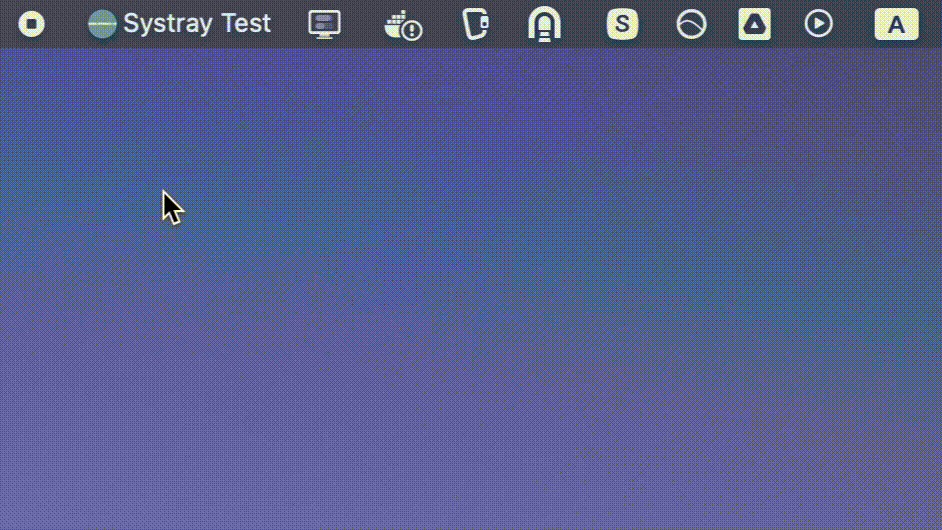

# node-systray-v2

<div align="center">
  <a href="https://github.com/Edgar-P-yan/node-systray-v2">
    
  </a>
  <br>
  <br>
</div>

[](https://github.com/Edgar-P-Yan/node-systray-v2/actions/workflows/continuous-integrations.yaml)
[](./LICENSE)
[](https://badge.fury.io/js/node-systray-v2)
[](https://packagephobia.com/result?p=node-systray-v2)

`node-systray-v2` is a cross-platform systray library for node.js with precompiled binaries. It is a successor of the now unmaintained library [node-systray](https://github.com/zaaack/node-systray).

## Installation

```sh
npm install --save node-systray-v2

# For Yarn, use the command below.
yarn add node-systray-v2
```

## Preview
Source code of this preview is at [./examples/preview/](./examples/preview/).



## Quick example

```ts
import SysTray from 'systray';

const systray = new SysTray({
  menu: {
    // you should using .png icon in macOS/Linux, but .ico format in windows
    icon: '<base64 png/ico string>',
    title: '标题',
    tooltip: 'Tips',
    items: [
      {
        title: 'aa',
        tooltip: 'bb',
        // checked is implement by plain text in linux
        checked: true,
        enabled: true,
      },
      {
        title: 'aa2',
        tooltip: 'bb',
        checked: false,
        enabled: true,
      },
      {
        title: 'Exit',
        tooltip: 'bb',
        checked: false,
        enabled: true,
      },
    ],
  },
  debug: false,
  copyDir: true, // copy go tray binary to outside directory, useful for packing tool like pkg.
});

systray.onClick((action) => {
  if (action.seq_id === 0) {
    systray.sendAction({
      type: 'update-item',
      item: {
        ...action.item,
        checked: !action.item.checked,
      },
      seq_id: action.seq_id,
    });
  } else if (action.seq_id === 1) {
    // open the url
    console.log('open the url', action);
  } else if (action.seq_id === 2) {
    systray.kill();
  }
});
```

## Examples

Take a look at the [examples](./examples).

## API Documentation

[Documentation generated from source files by Typedoc](./docs/README.md).

## License

Released under [MIT License](./LICENSE).
